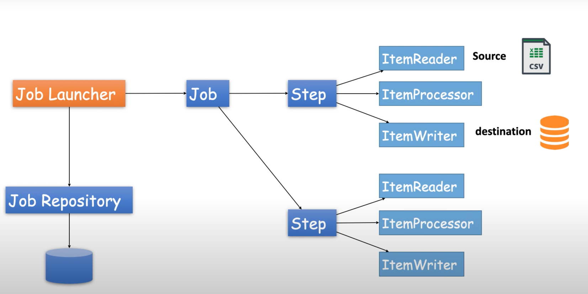

### Job:
- Highest level component, represents entire batch process

### Step:
Independent unit of work within a job. 
- Each step typically has a single responsibility
- Can be a ItermReader, ItemProcessor, ItemWriter,

### Item Reader:
- Reads data from a data source in chunks

### Item Processor:
- Processes data from the ItemReader
- Can be used to transform data and then pass it to the ItemWriter

### Item Writer:
- Writes data to a data source in chunks

### Job Repository:
- Stores meta-data about the job and step execution
- Used to restart jobs after a failure

### Job Launcher:
- Starts a job execution manually or via a schedule

### Job Parameters:
- Used to pass parameters to a job at runtime

### Decider:
- A Decider is a component that can be used within a Flow to determine the next Step to execute
- It's typically used for conditional branching logic

### Tasklet vs Chunk Oriented Processing:
- Tasklet: 
    - A Tasklet is a simple interface that has a single method, execute()
    - A Tasklet typically performs a single task or unit of work
    - A Tasklet is not designed for processing large volumes of data
    - A Tasklet is typically used for pre or post processing
- Chunk Oriented Processing:
    - Chunk Oriented Processing is designed for high volume data processing
    - A Chunk Oriented Task is a unit of work that can be applied to a single transactional unit
    - A Chunk Oriented Task is typically used for reading, processing and writing large volumes of data
    - A Chunk Oriented Task is made up of 3 components: ItemReader, ItemProcessor, ItemWriter
